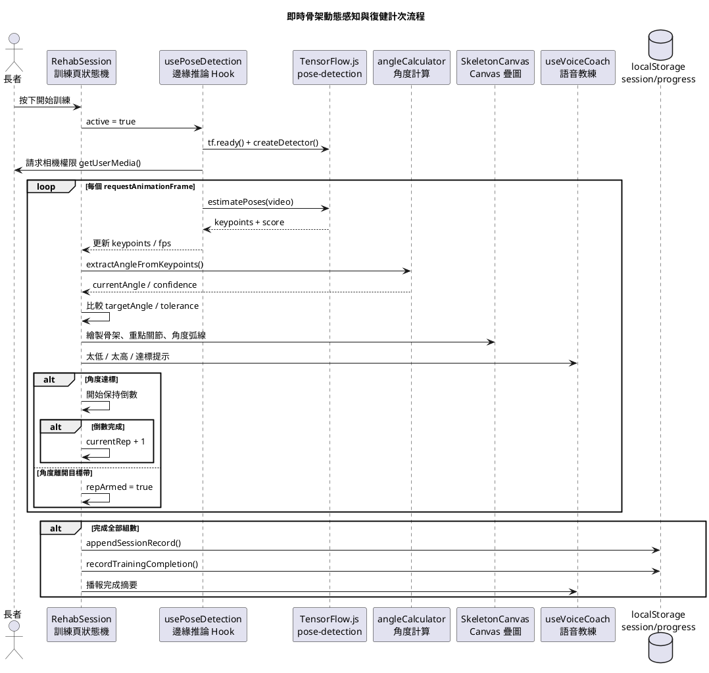
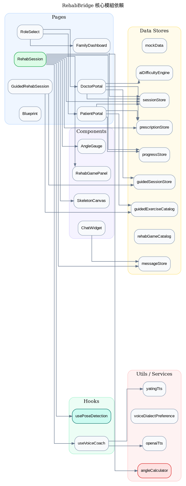
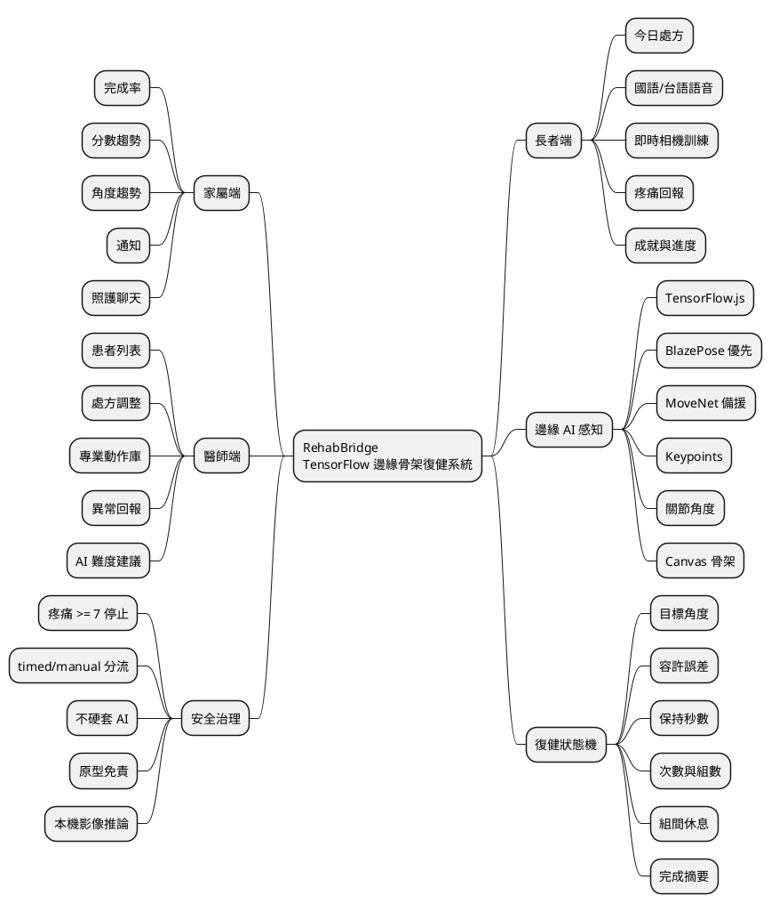
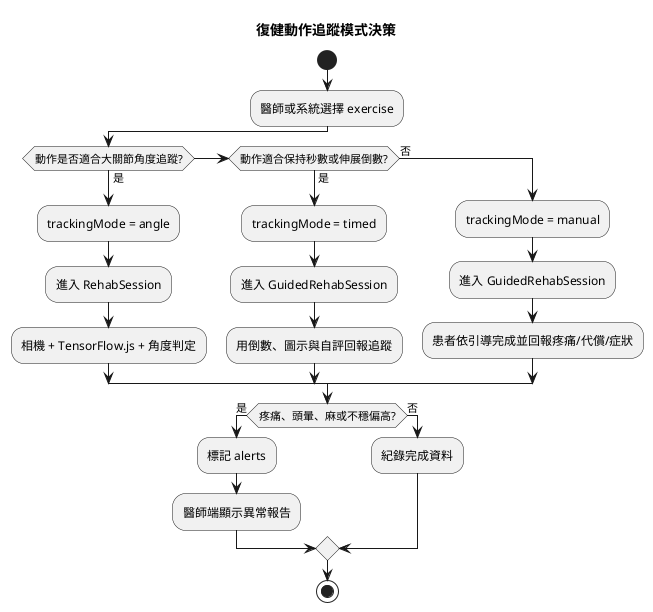

# 基於 TensorFlow 邊緣端點之即時骨架動態感知系統

## 專案說明書

版本：RehabBridge final  
專案定位：居家復健展示型 Web / iOS 原型  
核心命題：在使用者自己的瀏覽器或行動裝置上，以 TensorFlow.js 進行即時人體骨架偵測、關節角度分析、復健動作判定與語音回饋，讓長者可以在家中依照醫囑完成復健，家屬與醫師則能用視覺化介面追蹤進度與調整處方。

> 重要聲明：本系統是競賽展示與概念驗證原型，不構成醫療器材、臨床診斷工具或醫療建議。所有復健處方、角度目標與訓練強度仍應由合格醫事人員確認。

---

## 目錄

1. 專案總覽
2. 這個題目在做什麼
3. 系統特色摘要
4. 角色與使用場景
5. 整體架構
6. 技術棧與用途
7. 即時骨架動態感知流程
8. 復健動作判定邏輯
9. 長者端功能
10. 家屬端功能
11. 醫師端功能
12. 系統藍圖頁
13. 資料模型與 localStorage 設計
14. 語音教練與 TTS 設計
15. 遊戲化復健設計
16. 安全機制與風險控管
17. iOS / Capacitor 包裝
18. 主要檔案導覽
19. 系統亮點與特別之處
20. 限制、展示性質與未來擴充
21. 安裝、執行與部署
22. 附錄：圖表與流程

---

## 1. 專案總覽

RehabBridge 是一個以居家復健為情境的智慧復健追蹤系統。它把瀏覽器相機、TensorFlow.js 姿態偵測、關節角度計算、語音陪練、復健處方、家屬監看與醫師調整介面整合成同一套產品原型。

使用者打開 App 後，會看到四個入口：

- 長者端：查看今日訓練計畫、進入復健訓練、聽語音說明、完成角度追蹤訓練。
- 家屬端：查看長者完成率、近期分數、角度趨勢、訓練紀錄與通知。
- 醫師端：管理患者、查看分析圖表、調整訓練處方、建立新處方、查看 AI 難度建議。
- 系統藍圖：展示系統架構、使用流程、UI 規範、ML 邊緣運算流程。

系統的核心不是單純把骨架畫在畫面上，而是把「骨架關鍵點」轉成「復健可用的動作判定資料」。它會把人體關鍵點轉成關節角度，再用醫師處方設定的目標角度、容許誤差、保持秒數、組數、次數與安全範圍，判斷使用者目前做得太少、剛好、太多，並即時給出視覺與語音回饋。

---

## 2. 這個題目在做什麼

題目「基於 TensorFlow 邊緣端點之即時骨架動態感知系統」可以拆成五個核心概念：

### 2.1 TensorFlow

專案使用 TensorFlow.js 與 `@tensorflow-models/pose-detection`，在前端直接載入姿態偵測模型。實作上目前採用 accuracy-first 策略：

1. 優先嘗試 BlazePose MediaPipe runtime。
2. 若失敗，改用 BlazePose TFJS runtime。
3. 若仍失敗，最後備援到 MoveNet SinglePose Lightning。

README 與藍圖頁以 MoveNet 為主要展示敘事，實際程式則已加入 BlazePose 優先與 MoveNet fallback。這代表系統不是只寫死單一模型，而是具備模型降級能力。

### 2.2 邊緣端點

這裡的邊緣端點指使用者實際操作的瀏覽器、平板或 iOS WebView。相機畫面在本機端被送入 TensorFlow.js 推論，不需要先上傳到雲端伺服器才分析。

目前專案沒有後端影像上傳流程，因此骨架推論、角度計算、狀態判定與 Canvas 繪製都發生在前端。這種設計很適合復健與長者照護情境，因為相機畫面屬於高度敏感資料，能留在本機就能降低隱私與網路延遲風險。

### 2.3 即時

偵測迴圈使用 `requestAnimationFrame` 驅動。每一幀會從 video element 取得畫面，呼叫 `estimatePoses(video)`，再更新 keypoints、FPS、角度與 UI。系統不是錄完影片後才分析，而是使用者一邊動作、一邊看到骨架、角度、達標狀態、遊戲畫面與語音回饋。

### 2.4 骨架動態感知

系統將模型輸出的 keypoints 轉成以下資訊：

- 人體骨架節點與連線。
- 指定關節三點夾角。
- 目標角度偏差。
- 是否落在容許誤差內。
- 是否完成保持秒數。
- 是否完成一次、完成一組、完成全部訓練。
- 是否需要疼痛安全停機。

也就是說，系統感知的不是「畫面裡有人」，而是「使用者的特定復健關節是否達到處方要求」。

### 2.5 復健系統

專案不是單純技術 Demo，而是包成復健產品流程。它有處方、長者任務、家屬監看、醫師管理、動作庫、安全標籤、疼痛回報、聊天通知、成就系統與 AI 難度建議。

---

## 3. 系統特色摘要

### 3.1 主要功能

- 即時相機啟動與前置鏡頭追蹤。
- TensorFlow.js 姿態偵測，支援 BlazePose 與 MoveNet fallback。
- Canvas 2D 骨架繪製，包含節點、骨架連線、重點關節高亮與角度弧線。
- 關節三點向量夾角計算。
- 依處方目標角度、容許誤差、保持秒數判定動作是否完成。
- 長者友善大字級訓練介面。
- 國語與台語語音偏好。
- Web Speech API 本機語音。
- 可選雅婷 TTS。
- 可選 OpenAI TTS。
- 醫師端處方調整，支援目標角度、次數、組數、保持秒數與難度等級。
- localStorage 儲存訓練紀錄、處方覆寫、聊天訊息與進度。
- 家屬端儀表板，顯示完成率、平均分數、最高角度、本週訓練與近期紀錄。
- 醫師端分析圖表、患者列表、處方管理、專業動作庫與 AI 難度建議。
- 遊戲化復健畫面，例如足球射門、熱氣球、風車、星星採集、投籃、保齡球、小火箭等。
- 疼痛分數 >= 7 時自動暫停訓練並送出照護團隊訊息。
- Capacitor iOS 包裝，支援原生殼與 CapacitorHttp。
- PWA Service Worker 生產環境註冊。

### 3.2 特別亮點

1. 影像推論在裝置端完成，降低影像外傳風險。
2. 模型載入使用 lazy import，避免初始 bundle 一開始就塞入大型 ML 套件。
3. 使用 shared detector 與 idle warm-up，降低第一次開始訓練的等待感。
4. BlazePose 優先、MoveNet 備援，兼顧精度與可用性。
5. 支援 BlazePose 33 點與 MoveNet 17 點索引差異映射。
6. 左右側自動判斷加 hysteresis，降低雙側都入鏡時的抖動切換。
7. 計次不是單純角度達標就加一，而是達標後必須保持指定秒數。
8. 離開目標帶後才重新允許下一次計次，避免同一姿勢重複灌水。
9. 把不適合角度追蹤的動作分流到 timed/manual guided 模式，不硬套 AI 分數。
10. 語音、視覺、遊戲、疼痛回報與處方資料都接在同一個復健 session 流程。

---

## 4. 角色與使用場景

### 4.1 長者端

長者端是系統最重要的操作入口。設計重點是大字、清楚、少步驟、可聽語音、可直接開始訓練。

長者端可以做的事：

- 看今天要做哪些復健。
- 切換國語或台語語音偏好。
- 點選訓練卡片進入訓練頁。
- 在訓練頁開啟相機。
- 看即時骨架與角度。
- 看角度儀表與目標角度。
- 聽語音提示，例如「再開一點」、「收一點」、「穩住」。
- 回報疼痛分數。
- 達標並保持指定秒數後完成一次。
- 完成所有組數後看到分數、平均角度、最高角度與鼓勵訊息。
- 透過照護通知與醫師、治療師、家屬溝通。

### 4.2 家屬端

家屬端的目標不是取代醫師，而是提供照護者可快速理解的日常監看。

家屬端可以看到：

- 長者今天或近期有沒有訓練。
- 完成率。
- 平均分數。
- 最高角度。
- 本週總時長。
- 守護穩定度。
- 膝蓋角度進展圖。
- 本週訓練活動圖。
- 最近訓練紀錄。
- 通知訊息。

### 4.3 醫師端

醫師端偏向臨床管理與處方控制。它讓醫師可以用資料調整訓練，而不只是看長者有沒有打卡。

醫師端可以做的事：

- 查看患者列表。
- 查看患者完成率、分數與異常。
- 查看 angle session 與 guided session 的紀錄。
- 新增處方。
- 修改處方目標角度、次數、組數、保持秒數與難度。
- 查看專業動作庫哪些可以角度追蹤、哪些需要人工確認。
- 查看 guided session 回報中的異常，例如疼痛偏高、頭暈、麻、刺痛、腫脹、聳肩代償、腰部代償。
- 查看 AI 難度建議，決定是否升階、降階或維持。

### 4.4 開發者 / 評審

系統藍圖頁讓評審或開發者可以直接在 App 裡理解：

- 系統分層。
- 角色流程。
- UI 設計規範。
- ML 邊緣運算流程。
- 動作與關節索引設定。

---

## 5. 整體架構

RehabBridge 採用前端集中式原型架構。主要程式碼位於 `src/app`，以 React Router 管理頁面，以 hooks 封裝 ML 與語音，以 data modules 模擬後端資料來源與 localStorage 狀態同步。

### 5.1 架構圖

以下圖表使用 Markdown Viewer 的 architecture skill，以直接 HTML 嵌入 Markdown。注意：這段不是 HTML code block，而是可直接渲染的架構圖。

<div style="width: 1200px; box-sizing: border-box; position: relative; background: #f5f9f5; padding: 20px; border-radius: 8px; border: 1px solid #c3d9c3;">
  <style scoped>
    .arch-wrapper { display: flex; gap: 12px; }.arch-sidebar { width: 170px; flex-shrink: 0; }.arch-main { flex: 1; min-width: 0; }.arch-title { text-align: center; font-size: 22px; font-weight: bold; color: #14532d; margin-bottom: 16px; }.arch-layer { margin: 8px 0; padding: 14px; border-radius: 8px; box-shadow: 0 2px 8px rgba(22, 101, 52, 0.06); }.arch-layer-title { font-size: 13px; font-weight: bold; margin-bottom: 10px; text-align: center; }.arch-grid { display: grid; gap: 8px; }.arch-grid-2 { grid-template-columns: repeat(2, 1fr); }.arch-grid-3 { grid-template-columns: repeat(3, 1fr); }.arch-grid-4 { grid-template-columns: repeat(4, 1fr); }.arch-grid-5 { grid-template-columns: repeat(5, 1fr); }.arch-box { border-radius: 5px; padding: 8px; text-align: center; font-size: 11px; font-weight: 600; line-height: 1.35; color: #14532d; background: rgba(255, 255, 255, 0.9); border: 1px solid rgba(34, 197, 94, 0.15); }.arch-box.highlight { background: linear-gradient(135deg, #dcfce7 0%, #bbf7d0 100%); border: 2px solid #16a34a; }.arch-box.tech { font-size: 10px; color: #166534; background: rgba(240, 253, 244, 0.8); }.arch-layer.external { background: linear-gradient(135deg, #f3f8f3 0%, #e8f0e8 100%); border: 2px dashed #a3c0a3; }.arch-layer.external .arch-layer-title { color: #6b8f6b; }.arch-layer.user { background: linear-gradient(135deg, #dcfce7 0%, #bbf7d0 100%); border: 2px solid #22c55e; }.arch-layer.user .arch-layer-title { color: #15803d; }.arch-layer.application { background: linear-gradient(135deg, #d1fae5 0%, #a7f3d0 100%); border: 2px solid #059669; }.arch-layer.application .arch-layer-title { color: #047857; }.arch-layer.ai { background: linear-gradient(135deg, #ecfdf5 0%, #ccfbf1 100%); border: 2px solid #14b8a6; }.arch-layer.ai .arch-layer-title { color: #0f766e; }.arch-layer.data { background: linear-gradient(135deg, #fef3c7 0%, #fde68a 100%); border: 2px solid #ca8a04; }.arch-layer.data .arch-layer-title { color: #854d0e; }.arch-layer.infra { background: linear-gradient(135deg, #f1f5f9 0%, #e2e8f0 100%); border: 2px solid #64748b; }.arch-layer.infra .arch-layer-title { color: #334155; }.arch-sidebar-panel { border-radius: 8px; padding: 10px; background: linear-gradient(135deg, #e8f0e8 0%, #dce6dc 100%); border: 2px solid #86b086; margin-bottom: 8px; box-shadow: 0 1px 3px rgba(22, 101, 52, 0.04); }.arch-sidebar-title { font-size: 12px; font-weight: bold; text-align: center; color: #14532d; margin-bottom: 6px; }.arch-sidebar-item { font-size: 10px; text-align: center; color: #166534; background: rgba(255, 255, 255, 0.85); padding: 5px; border-radius: 4px; margin: 3px 0; border: 1px solid rgba(34, 197, 94, 0.12); }.arch-sidebar-item.metric { background: #dcfce7; border: 1px solid #22c55e; color: #15803d; font-weight: 600; }
  </style>
  <div class="arch-title">RehabBridge 即時骨架復健系統架構</div>
  <div class="arch-wrapper">
    <div class="arch-sidebar">
      <div class="arch-sidebar-panel"><div class="arch-sidebar-title">觀測與回饋</div><div class="arch-sidebar-item metric">FPS 顯示</div><div class="arch-sidebar-item">角度偏差</div><div class="arch-sidebar-item">完成率</div><div class="arch-sidebar-item">語音提醒次數</div></div>
      <div class="arch-sidebar-panel"><div class="arch-sidebar-title">分析</div><div class="arch-sidebar-item">Recharts 圖表</div><div class="arch-sidebar-item">排行榜</div><div class="arch-sidebar-item">週活動統計</div><div class="arch-sidebar-item">AI 難度建議</div></div>
      <div class="arch-sidebar-panel"><div class="arch-sidebar-title">展示用途</div><div class="arch-sidebar-item">mockData</div><div class="arch-sidebar-item">localStorage</div><div class="arch-sidebar-item">系統藍圖頁</div></div>
    </div>
    <div class="arch-main">
      <div class="arch-layer user"><div class="arch-layer-title">使用者與入口層</div><div class="arch-grid arch-grid-4"><div class="arch-box">長者端<br><small>今日計畫與訓練</small></div><div class="arch-box">家屬端<br><small>監看與關懷</small></div><div class="arch-box">醫師端<br><small>處方與分析</small></div><div class="arch-box">系統藍圖<br><small>架構與 ML 流程</small></div></div></div>
      <div class="arch-layer application"><div class="arch-layer-title">React 應用層</div><div class="arch-grid arch-grid-5"><div class="arch-box highlight">RehabSession<br><small>核心訓練狀態機</small></div><div class="arch-box">GuidedRehabSession<br><small>計時/人工回報</small></div><div class="arch-box">PatientPortal<br><small>處方任務入口</small></div><div class="arch-box">FamilyDashboard<br><small>照護儀表板</small></div><div class="arch-box">DoctorPortal<br><small>醫師管理台</small></div></div></div>
      <div class="arch-layer ai"><div class="arch-layer-title">邊緣感知與智慧層</div><div class="arch-grid arch-grid-4"><div class="arch-box highlight">usePoseDetection<br><small>TF.js / pose-detection</small></div><div class="arch-box">angleCalculator<br><small>三點向量夾角</small></div><div class="arch-box">useVoiceCoach<br><small>Web Speech / TTS</small></div><div class="arch-box">aiDifficultyEngine<br><small>升降階建議</small></div></div></div>
      <div class="arch-layer data"><div class="arch-layer-title">資料與領域模型層</div><div class="arch-grid arch-grid-5"><div class="arch-box tech">mockData<br><small>患者/處方/動作</small></div><div class="arch-box tech">sessionStore<br><small>角度訓練紀錄</small></div><div class="arch-box tech">guidedSessionStore<br><small>引導訓練回報</small></div><div class="arch-box tech">prescriptionStore<br><small>處方覆寫</small></div><div class="arch-box tech">messageStore<br><small>照護聊天</small></div></div></div>
      <div class="arch-layer infra"><div class="arch-layer-title">執行與平台層</div><div class="arch-grid arch-grid-5"><div class="arch-box tech">Vite 6<br><small>開發與打包</small></div><div class="arch-box tech">React Router 7<br><small>路由</small></div><div class="arch-box tech">Tailwind CSS 4<br><small>UI 樣式</small></div><div class="arch-box tech">Capacitor 8<br><small>iOS 原生殼</small></div><div class="arch-box tech">Service Worker<br><small>PWA 快取</small></div></div></div>
      <div class="arch-layer external"><div class="arch-layer-title">可選外部服務</div><div class="arch-grid arch-grid-4"><div class="arch-box tech">雅婷 TTS<br><small>國語/台語語音</small></div><div class="arch-box tech">OpenAI TTS<br><small>自然語音</small></div><div class="arch-box tech">MediaPipe CDN<br><small>BlazePose runtime</small></div><div class="arch-box tech">未來後端<br><small>FHIR/雲端同步</small></div></div></div>
    </div>
    <div class="arch-sidebar">
      <div class="arch-sidebar-panel"><div class="arch-sidebar-title">安全</div><div class="arch-sidebar-item">本機影像推論</div><div class="arch-sidebar-item">疼痛停機</div><div class="arch-sidebar-item">安全範圍</div><div class="arch-sidebar-item">相機權限</div></div>
      <div class="arch-sidebar-panel"><div class="arch-sidebar-title">可及性</div><div class="arch-sidebar-item">大字級</div><div class="arch-sidebar-item">語音教練</div><div class="arch-sidebar-item">台語偏好</div><div class="arch-sidebar-item">觸控友善</div></div>
      <div class="arch-sidebar-panel"><div class="arch-sidebar-title">治理</div><div class="arch-sidebar-item">原型免責</div><div class="arch-sidebar-item">醫師覆核</div><div class="arch-sidebar-item">不硬套 AI</div><div class="arch-sidebar-item">人工模式</div></div>
    </div>
  </div>
</div>

### 5.2 分層說明

#### 使用者與入口層

這一層由 `RoleSelect` 與 React Router 管理。使用者不需要登入流程，直接透過角色卡片進入不同視角。這是展示型原型常見做法，讓評審可以快速體驗三方角色。

#### React 應用層

主要頁面如下：

- `RoleSelect`：角色入口。
- `PatientPortal`：長者端首頁。
- `RehabSession`：角度追蹤訓練頁，是整個專案的核心頁面。
- `GuidedRehabSession`：非角度追蹤動作的計時或人工回報頁。
- `FamilyDashboard`：家屬端。
- `DoctorPortal`：醫師端。
- `Blueprint`：系統藍圖頁。

#### 邊緣感知與智慧層

這一層處理即時推論與復健判定：

- `usePoseDetection` 負責模型載入、相機啟動、姿態推論與 FPS。
- `angleCalculator` 負責關節角度、左右鏡像、BlazePose/MoveNet 索引相容。
- `RehabSession` 負責狀態機、計次、休息、完成與安全停機。
- `useVoiceCoach` 負責本機與遠端 TTS 播放。
- `aiDifficultyEngine` 負責依近期訓練數據給醫師升降階建議。

#### 資料與領域模型層

這一層沒有真正後端，採 mock + localStorage：

- mock 資料提供初始患者、醫師、治療師、處方、動作庫、歷史紀錄。
- localStorage 儲存使用者在展示過程中新增的訓練、處方、聊天與進度。
- 自訂事件與 `storage` 事件讓同頁、跨頁或分頁變更後 UI 能更新。

#### 執行與平台層

系統使用 Vite 打包，React Router 執行 SPA 路由，Tailwind CSS 管理視覺，Capacitor 提供 iOS 原生殼。

---

## 6. 技術棧與用途

### 6.1 前端框架

| 技術 | 版本 / 套件 | 用途 |
|---|---|---|
| React | 18.3.1 | UI component 架構、hook 狀態管理 |
| TypeScript | 6.0.2 | 型別、安全資料結構、復健領域模型 |
| Vite | 6.3.5 | 開發伺服器、打包、代理 TTS API |
| React Router | 7.13.0 | `/patient`、`/doctor` 等頁面路由 |
| Tailwind CSS | 4.1.12 | 大量介面排版與視覺樣式 |
| motion | 12.23.24 | 頁面動畫、按鈕互動、遊戲化動畫 |
| Recharts | 2.15.2 | 家屬端與醫師端趨勢圖、柱狀圖、雷達圖等 |

### 6.2 AI / ML

| 技術 | 用途 |
|---|---|
| `@tensorflow/tfjs` | 在瀏覽器或 WebView 中執行模型推論 |
| `@tensorflow-models/pose-detection` | 統一載入 BlazePose / MoveNet 姿態偵測模型 |
| BlazePose MediaPipe runtime | 優先使用，取得更完整的人體關鍵點 |
| BlazePose TFJS runtime | MediaPipe 失敗時的第二層 fallback |
| MoveNet SinglePose Lightning | 最終 fallback，速度快、適合單人姿態追蹤 |

### 6.3 語音與 TTS

| 技術 | 用途 |
|---|---|
| Web Speech API | 預設本機語音，無需金鑰 |
| 雅婷 TTS v2 | 可選國語與台語語音，支援 `zh_en_*` 與 `tai_*` 聲線 |
| OpenAI TTS | 可選自然語音生成 |
| Vite Proxy | 開發環境代理 `/api/yating`、`/api/openai`，避免 API key 直接進前端 bundle |
| CapacitorHttp | iOS WebView 內呼叫雅婷 API，避開 WKWebView CORS 問題 |

### 6.4 原生與 PWA

| 技術 | 用途 |
|---|---|
| Capacitor 8 | 將 Web App 包裝成 iOS App |
| iOS scheme `https` | iOS WebView 環境支援安全來源 |
| Service Worker | 生產環境註冊 `/sw.js`，支援 PWA 快取概念 |

### 6.5 UI 元件

專案包含許多 `src/app/components/ui` 內的元件，風格接近 shadcn/ui / Radix UI 架構，並搭配 Lucide icon、MUI icon 與自訂視覺元件。

---

## 7. 即時骨架動態感知流程

### 7.1 高階流程

完整 runtime pipeline 如下：

1. 使用者進入長者端。
2. 長者選擇今日處方中的復健動作。
3. 系統進入 `RehabSession`。
4. 使用者按開始。
5. `usePoseDetection` 啟動相機。
6. TensorFlow.js 初始化並建立姿態偵測器。
7. 每個 animation frame 呼叫 `estimatePoses(video)`。
8. 模型輸出 keypoints。
9. 系統依指定關節三點計算角度。
10. 系統比較目前角度與處方目標角度。
11. UI 顯示骨架、角度儀表、遊戲畫面與回饋文字。
12. 語音教練依狀態提醒。
13. 若角度達標，進入保持倒數。
14. 倒數完成後才計為一次。
15. 完成一組後進入休息倒數。
16. 完成所有組數後寫入 session record 與 progress record。

### 7.2 時序圖



### 7.3 模型載入與 fallback

`usePoseDetection` 中使用幾個 module-level cache：

- `tfReadyPromise`
- `poseDetectionModulePromise`
- `sharedDetectorPromise`
- `sharedDetector`

這樣做的目的：

1. TensorFlow.js 不重複初始化。
2. pose-detection 模組不重複載入。
3. detector 不在每次進入訓練頁時重建。
4. 停止相機後保留 detector，下一次開始比較快。

模型建立策略：

```text
BlazePose MediaPipe runtime
        ↓ 失敗
BlazePose TFJS runtime
        ↓ 失敗
MoveNet SinglePose Lightning
```

這個策略讓系統能在不同瀏覽器、網路與 WebView 環境下盡量保持可用。若 MediaPipe 相關資源載入失敗，系統不會直接整個壞掉，而會降級到 TFJS 或 MoveNet。

### 7.4 相機設定

相機由 `navigator.mediaDevices.getUserMedia` 啟動：

- `facingMode: 'user'`
- `width: { ideal: 1280 }`
- `height: { ideal: 720 }`
- `audio: false`

這代表系統預期長者使用前鏡頭，以平板或筆電面向自己訓練。音訊不會被請求，降低權限敏感度。

### 7.5 即時偵測迴圈

偵測迴圈具備以下特性：

- 使用 `requestAnimationFrame`，與瀏覽器繪製節奏同步。
- video 尚未 ready 時跳過該幀。
- 每秒計算一次 FPS。
- 偵測不到人時清空 keypoints，但保持 detecting 狀態。
- frame estimation 連續錯誤時累積錯誤次數。
- 超過錯誤門檻後 reset shared detector 並顯示錯誤。

### 7.6 Keypoints 正規化

模型回傳的 keypoints 會被轉成專案統一格式：

```ts
{
  name: kp.name,
  x: kp.x,
  y: kp.y,
  score: kp.score,
  index
}
```

後續所有角度計算、骨架繪製、可信度判斷都使用這個格式。

---

## 8. 復健動作判定邏輯

### 8.1 關節角度計算

系統用三個關節點定義一個角度：

- `p1`
- `vertex`
- `p2`

例如膝蓋彎曲常見設定為：

- 髖部
- 膝蓋
- 腳踝

角度公式是向量內積：

```text
v1 = p1 - vertex
v2 = p2 - vertex
angle = acos((v1 · v2) / (|v1| |v2|)) × 180 / π
```

系統會將結果四捨五入為整數角度，並與目標角度比較。

### 8.2 角度狀態

`getAngleResult` 會回傳：

- `angle`：目前角度。
- `status`：`below`、`achieved`、`above`、`unknown`。
- `deviation`：目前角度與目標角度差。
- `percentage`：朝目標角度前進的百分比。

判定邏輯：

- `abs(currentAngle - targetAngle) <= tolerance` 時為 `achieved`。
- `currentAngle < targetAngle` 時為 `below`。
- `currentAngle > targetAngle` 時為 `above`。

### 8.3 可信度過濾

`extractAngleFromKeypoints` 預設要求每個 keypoint 的 `score >= 0.3`。只要三個點有任一點不存在或低於信心門檻，就回傳 `null`，代表本幀沒有可靠角度。

這可避免模型偶發錯點時讓系統亂計次。

### 8.4 BlazePose 與 MoveNet 索引相容

BlazePose 有較多 keypoints，MoveNet 常見是 17 點。專案中用 `BLAZE_TO_MOVENET_INDEX` 將部分 BlazePose index 對應到 MoveNet index。

例如：

- BlazePose 肩、肘、腕會對應到 MoveNet 上肢索引。
- BlazePose 髖、膝、踝會對應到 MoveNet 下肢索引。
- BlazePose 足部點在 MoveNet 中近似對應到 ankle。

這讓動作資料可以用較完整的 BlazePose 索引描述，但在 fallback 到 MoveNet 時仍能盡量運作。

### 8.5 左右側自動切換

復健時長者可能鏡頭方向不同，或左側、右側其中一側比較清楚。`RehabSession` 會同時計算：

- primary joints
- mirrored joints

接著用以下資訊評分：

- 是否有成功算出角度。
- 三點平均 confidence。
- 與目標角度的接近程度。

若 mirrored 分數明顯比 primary 高，就切換到 mirrored。程式使用 switch threshold 避免左右側在連續幀中抖動切換，這是一個很實用的即時影像 UX 細節。

### 8.6 計次狀態機

系統不是角度一達標就算完成，而是有完整狀態機：

1. 尚未開始：等待使用者按開始。
2. 偵測中：相機與模型啟動。
3. 太低或太高：給出調整提示。
4. 達標：開始保持倒數。
5. 保持中：倒數到 0。
6. 完成一次：`currentRep + 1`。
7. 離開目標帶：重新允許下一次計次。
8. 完成一組：進入休息倒數。
9. 休息結束：進入下一組。
10. 完成全部：儲存訓練紀錄與完成摘要。

### 8.7 防止重複計次

這是專案的重要細節。當使用者達標並完成一次後，`repArmed` 會變成 false。只有當角度離開目標帶超過 `effectiveTolerance + repRearmMargin`，才會重新變成 true。

也就是說，長者不能只停在同一個角度上，讓系統每幾秒一直算一次。必須先回到動作起始區間或至少離開目標區，再進入下一次。

### 8.8 成績計算

完成訓練後，系統會統計：

- 平均角度 `avgAngle`
- 最高角度 `maxAngle`
- 訓練時間 `elapsedMinutes`
- 目標角度 `targetAngle`
- 語音回饋次數 `voiceFeedbackCount`

目前分數公式：

```text
angleAccuracy = max(0, 100 - abs(targetAngle - avgAngle) * 2)
score = clamp(round(angleAccuracy * 0.8 + 20), 0, 100)
```

也就是平均角度越接近處方目標，分數越高。同時給基本分 20，使完成訓練的人不會因角度偏差直接歸零。

---

## 9. 長者端功能

### 9.1 今日訓練計畫

長者端會從處方資料中整理今日可做項目。邏輯重點：

- 優先使用目前 active 的處方。
- 若沒有處方，才用動作庫 fallback。
- 分類排序：下肢、上肢、核心、踝足、頸部。
- 今日計畫不是把整本動作庫都塞給長者，而是控制數量。
- 腿部與核心合計最多 2 項，上肢最多 2 項。

這符合長者端 UX：任務不能太多，否則會造成認知負擔。

### 9.2 語音偏好

長者端可以選國語或台語。偏好存在 localStorage，復健頁會同步讀取。事件包含：

- 自訂事件 `rehab-voice-dialect-change`
- 瀏覽器 `storage` 事件

這樣同頁或其他分頁變更語音偏好時，訓練頁能同步更新。

### 9.3 訓練頁

`RehabSession` 是系統核心。它包含：

- video 相機畫面。
- canvas 骨架疊圖。
- 角度儀表 `AngleGauge`。
- 遊戲面板 `RehabGamePanel`。
- 語音開場說明。
- 即時回饋訊息。
- 組數、次數、保持秒數、休息秒數。
- 疼痛回報。
- 安全停機 overlay。
- 完成摘要 overlay。

### 9.4 開場說明

開始前系統會整理：

- 今天做哪個動作。
- 目標角度幾度。
- 一組幾下。
- 總共幾組。
- 達標後保持幾秒。
- 專業注意事項。

若使用台語偏好且該動作有台語稿，系統會使用台語稿與台語聲線。

### 9.5 疼痛回報

訓練頁提供 0 到 10 疼痛分數。若分數 >= 7：

1. 系統暫停相機訓練狀態。
2. 取消保持倒數。
3. 取消休息倒數。
4. 顯示警示訊息。
5. 播放語音警告。
6. 送出照護團隊聊天訊息。

這讓「安全」不只是文字提醒，而是接進訓練狀態機。

---

## 10. 家屬端功能

家屬端位於 `/family`。它將長者資料轉成照護者容易理解的資訊。

### 10.1 核心指標

家屬端顯示：

- 完成率。
- 平均分數。
- 最高角度。
- 連續天數。
- 本週總時長。
- 守護穩定度。

其中平均分數與總時長會根據 session records 計算；session records 是 mock 記錄與 localStorage 自訂記錄合併後的結果。

### 10.2 趨勢圖

家屬端使用 Recharts 顯示：

- 膝蓋角度進展。
- 本週訓練活動。
- 近期訓練資料。

### 10.3 通知與照護

家屬端有通知抽屜，顯示 mock 通知。整體 App 還有浮動聊天按鈕，家屬可以透過 `ChatWidget` 進入照護團隊對話。

---

## 11. 醫師端功能

醫師端位於 `/doctor`，是整個產品原型中最偏管理與臨床決策支援的部分。

### 11.1 患者管理

醫師端會列出隸屬該醫師的患者，例如：

- 王大明：右膝退化性關節炎。
- 李秀英：左肩旋轉肌袖受傷術後。
- 張福壽：腦中風後右側肢體偏癱。
- 陳阿蘭：全髖關節置換術後。

這些來自 `mockData.ts`。

### 11.2 處方管理

醫師可以修改或新增處方。處方欄位包含：

- exerciseId
- targetAngle
- reps
- sets
- holdSeconds
- difficultyLevel
- trackingMode
- frequency
- notes
- startDate / endDate
- active

### 11.3 難度等級

處方有 1 到 5 關：

| 等級 | 標籤 | 影響 |
|---|---|---|
| 1 | 輕鬆 | 降低角度、次數、組數與保持秒數，容許誤差較寬 |
| 2 | 標準 | 醫囑基準 |
| 3 | 挑戰 | 小幅增加目標角度、次數與保持秒數 |
| 4 | 進階 | 增加組數與保持秒數，容許誤差更嚴格 |
| 5 | 極限 | 高強度關卡，但仍有安全上限 |

`resolvePrescriptionPlan` 會把醫師處方與難度 meta 合併，產生有效訓練參數：

- `effectiveTargetAngle`
- `effectiveTolerance`
- `effectiveReps`
- `effectiveSets`
- `effectiveHoldSeconds`
- `safetyMinAngle`
- `safetyMaxAngle`
- `safetyNote`

### 11.4 AI 難度建議

`aiDifficultyEngine` 會檢查近期訓練：

- 最近訓練數量。
- 平均分數。
- 平均角度偏差。
- 平均語音提醒次數。
- 完成率。

若資料不足，回傳 `not_enough_data`。  
若最近三次表現穩定、分數高、完成率高、語音提醒少，建議升階。  
若分數低、偏差大、提醒多或完成率低，建議降階。  
其他情況維持。

這不是黑箱 AI 模型，而是規則式臨床決策輔助。好處是可解釋、容易展示，也比較適合原型階段。

### 11.5 專業動作庫

`professionalExerciseLibrary` 把動作分成：

- `angle-supported`：適合鏡頭角度追蹤。
- `manual-review`：需要治療師確認，不適合硬套 2D 骨架角度。

這是一個很重要的產品判斷。許多復健動作，例如頸部旋轉、踝內外翻、脊椎旋轉，單靠一般 2D 人體骨架不一定可靠。專案沒有硬把所有動作都說成 AI 可追蹤，而是保留人工模式與風險說明。

---

## 12. 系統藍圖頁

`Blueprint` 頁面是內建的開發展示文件。它包含四個 tab：

- 系統架構。
- 使用流程。
- UI 設計規範。
- ML 邊緣運算。

這個頁面本身就是競賽展示亮點，因為評審可以在 App 裡直接看到系統如何設計，而不是只能聽簡報。

藍圖頁中的 ML pipeline 描述包含：

1. 相機初始化。
2. 模型載入。
3. 推理迴圈。
4. 關鍵點過濾。
5. 角度計算。
6. 狀態判斷。
7. 骨架繪製。
8. 語音反饋。

---

## 13. 資料模型與 localStorage 設計

### 13.1 為什麼用 mock + localStorage

這是展示型原型，重點是展示產品流程與 AI 感知能力，不是後端系統。因此目前使用：

- `mockData.ts` 作為預設資料。
- localStorage 作為互動後的暫存資料。
- custom event 作為同頁同步。
- storage event 作為跨分頁同步。

### 13.2 sessionStore

檔案：`src/app/data/sessionStore.ts`

儲存 key：

```text
rehabbridge.customSessionRecords.v1
```

主要功能：

- 讀取自訂訓練紀錄。
- 與 `mockSessionRecords` 合併。
- 依日期排序。
- 新增 session record。
- 產生週活動統計。
- 建立排行榜。
- 找個人最佳紀錄。
- React hook `useSessionRecords` 同步資料。

訓練紀錄欄位包含：

- patientId
- exerciseId
- date
- duration
- completedSets
- completedReps
- avgAngle
- maxAngle
- targetAngle
- score
- voiceFeedbackCount

### 13.3 guidedSessionStore

檔案：`src/app/data/guidedSessionStore.ts`

儲存 key：

```text
rehabbridge.guidedSessionRecords.v1
```

用途：

- 儲存 timed/manual guided session。
- 記錄疼痛、主觀難度、是否中途停止、動作專屬回報問題。
- 供醫師端產生異常報告。

### 13.4 prescriptionStore

檔案：`src/app/data/prescriptionStore.ts`

儲存 key：

```text
rehabbridge.prescriptionOverrides.v1
```

用途：

- 對 mock 處方做本機覆寫。
- 儲存醫師新增的 custom prescription。
- 合併 mock + custom + overrides。
- 依難度等級解析實際訓練參數。

### 13.5 progressStore

檔案：`src/app/data/progressStore.ts`

儲存 key：

```text
rehabbridge.patientProgress.v1
```

用途：

- 記錄首次開啟日期。
- 記錄開啟 App 的日期。
- 記錄完成訓練日期。
- 記錄補救 token。
- 解鎖徽章。
- 計算 progress summary。

### 13.6 messageStore

檔案：`src/app/data/messageStore.ts`

儲存 key：

```text
rehabbridge.chat.messages.v1
rehabbridge.chat.readReceipts.v1
```

用途：

- 合併 mock 訊息與本機訊息。
- 建立照護團隊成員。
- 發送聊天訊息。
- 標記已讀。
- 計算未讀數。

---

## 14. 語音教練與 TTS 設計

### 14.1 語音策略

語音教練由 `useVoiceCoach` 封裝。它支援三種 provider：

1. `browser`：Web Speech API。
2. `yating`：雅婷 TTS。
3. `openai`：OpenAI TTS。

選擇邏輯：

- 如果 `VITE_TTS_PROVIDER=yating` 且雅婷設定完成，使用雅婷。
- 否則如果 `VITE_TTS_PROVIDER=openai` 且 OpenAI 設定完成，使用 OpenAI。
- 否則使用瀏覽器本機語音。

### 14.2 語音節流

語音教練有 throttle 機制。訓練頁設定約 3000ms，避免使用者動作在目標附近抖動時一直重複播報。

### 14.3 本機語音

本機語音使用 `SpeechSynthesisUtterance`，會優先挑選：

- 與 `zh-TW` 完全相符的語音。
- 同語系中文語音。
- Microsoft Natural / Online 中文語音。

若找不到理想聲音，退回瀏覽器可用語音。

### 14.4 雅婷 TTS

雅婷服務檔案：`src/app/services/yatingTts.ts`

特色：

- 支援國語 `zh_en_female_2`。
- 支援台語 `tai_female_2`。
- 可用 `.env` 覆寫 voice model。
- 台語模型採 16K sample rate。
- 國語模型採 22K sample rate。
- 開發環境可走 Vite proxy。
- iOS Capacitor 環境可走 `CapacitorHttp`。
- 會將 base64 audioContent 轉成 WAV Blob 播放。

### 14.5 OpenAI TTS

OpenAI 服務檔案：`src/app/services/openaiTts.ts`

預設：

- model：`gpt-4o-mini-tts`
- voice：`coral`
- response format：mp3
- instructions：自然、溫暖、像旁邊教練的國語語氣

開發環境可走 `/api/openai` Vite proxy，避免把 `OPENAI_API_KEY` 放入前端 bundle。

### 14.6 語音內容來源

語音內容來自幾個地方：

- `mockData.ts` 中每個 exercise 的 `voicePrompts`。
- `voicePromptsTai` 台語稿。
- `rehabCompanionCoach` 生成的本機教練句。
- 完成摘要中的分數、平均角度、最高角度與穩定度描述。
- 疼痛安全停機警告。

---

## 15. 遊戲化復健設計

### 15.1 設計目的

復健最難的是持續做。遊戲化面板不是為了娛樂而娛樂，而是把抽象角度變成長者能理解的任務。例如：

- 角度到位，足球才能射門。
- 抬腿穩定，熱氣球才會升空。
- 肩膀外展達標，風車才會發電。
- 手肘彎曲到位，投籃才會蓄力。

### 15.2 遊戲資料

檔案：`src/app/data/rehabGameCatalog.ts`

支援的 visual 包含：

- `soccer`
- `balloon`
- `windmill`
- `starReach`
- `basketCharge`
- `bowling`
- `rocket`
- `elevator`
- `gate`
- `bridge`

### 15.3 遊戲狀態

`RehabGamePanel` 根據訓練狀態顯示不同文字：

- 尚未開始：顯示 action cue。
- 看不到有效角度：提醒站到畫面中央。
- 角度太低：顯示 below cue。
- 角度太高：顯示 above cue。
- 角度達標：顯示 success cue。
- 保持中：顯示倒數。
- 休息中：提醒休息。
- 安全停機：遊戲暫停。
- 完成：顯示 reward 已記錄。

### 15.4 遊戲化與醫囑安全

遊戲不會要求使用者超出醫師處方角度。所有動畫進度都由目標角度與容許範圍驅動，遊戲只是把醫囑轉成直覺回饋。

---

## 16. 安全機制與風險控管

### 16.1 疼痛安全停機

疼痛分數 >= 7 時：

- 停止偵測活動。
- 清除 hold timer。
- 清除 rest timer。
- 設定 `safetyStopped = true`。
- 播報「請先停止訓練」。
- 發送照護團隊訊息。

這比單純提醒更進一步，因為狀態機真的會停止訓練。

### 16.2 安全角度範圍

`resolveSafetyRange` 會依動作部位設定安全範圍：

- 肩、膝有較寬 base margin。
- 髖、腿有不同上限。
- 上肢或肩部 upper cap 會保守限制。
- 膝蓋伸直類動作會設定 lower cap。

### 16.3 動作分流

系統承認某些動作不適合鏡頭角度追蹤：

- 頸部小角度或有神經症狀風險的動作。
- 踝部內外翻。
- 脊椎旋轉。
- 需要辨識骨盆翻轉或軀幹代償的動作。

這些會分到 timed 或 manual guided session，不強行用角度分數判定。

### 16.4 隱私

目前相機畫面只在本機前端進行推論。系統沒有將 video frame 傳到後端。需要注意的是，如果啟用雲端 TTS，語音文字會送到雅婷或 OpenAI 服務，而不是影像。

### 16.5 原型限制

目前沒有：

- 真正登入與權限控制。
- 真正後端資料庫。
- 真正醫療資料標準交換。
- 真正醫師簽核流程。
- 真正臨床驗證。

因此它適合展示架構、互動流程與技術可行性，但不能直接當正式醫療產品使用。

---

## 17. iOS / Capacitor 包裝

專案包含 Capacitor 設定：

- appId：`com.rehabbridge.app`
- appName：`RehabBridge`
- webDir：`dist`
- iOS scheme：`https`
- CapacitorHttp enabled

iOS 相關命令：

```bash
npm run build
npm run cap:sync
npm run cap:open:ios
npm run cap:run:ios
```

Capacitor 的重要用途：

1. 讓 Web App 可以包成 iOS App。
2. 在 WKWebView 中提供原生 HTTP 能力。
3. 解決雅婷 TTS 在 WebView 內可能遇到的 CORS 問題。

---

## 18. 主要檔案導覽

### 18.1 App 入口

| 檔案 | 說明 |
|---|---|
| `src/main.tsx` | React root、CSS 匯入、生產環境 Service Worker 註冊 |
| `src/app/App.tsx` | 掛載 `RouterProvider` |
| `src/app/routes.tsx` | 路由與主 layout，包含浮動聊天入口 |

### 18.2 頁面

| 檔案 | 說明 |
|---|---|
| `src/app/pages/RoleSelect.tsx` | 角色入口 |
| `src/app/pages/PatientPortal.tsx` | 長者端首頁、今日計畫、成就與 AI 建議入口 |
| `src/app/pages/RehabSession.tsx` | 即時骨架角度追蹤訓練 |
| `src/app/pages/GuidedRehabSession.tsx` | timed/manual guided 動作 |
| `src/app/pages/FamilyDashboard.tsx` | 家屬監看 |
| `src/app/pages/DoctorPortal.tsx` | 醫師管理與處方 |
| `src/app/pages/Blueprint.tsx` | 系統設計藍圖 |

### 18.3 Hooks

| 檔案 | 說明 |
|---|---|
| `src/app/hooks/usePoseDetection.ts` | TensorFlow.js 模型、相機、推論 loop |
| `src/app/hooks/useVoiceCoach.ts` | Web Speech / 雅婷 / OpenAI TTS 播放 |

### 18.4 Components

| 檔案 | 說明 |
|---|---|
| `src/app/components/SkeletonCanvas.tsx` | 骨架、節點、角度弧線繪製 |
| `src/app/components/AngleGauge.tsx` | 角度儀表 |
| `src/app/components/RehabGamePanel.tsx` | 遊戲化復健畫面 |
| `src/app/components/ChatWidget.tsx` | 照護團隊聊天 |

### 18.5 Utilities

| 檔案 | 說明 |
|---|---|
| `src/app/utils/angleCalculator.ts` | 角度計算、keypoint 查找、鏡像、骨架連線 |
| `src/app/utils/poseLogic.ts` | 早期動作邏輯定義與簡易角度函式 |
| `src/app/utils/voiceDialectPreference.ts` | 國語/台語偏好讀寫 |
| `src/app/utils/minNanSpeechNumbers.ts` | 台語語音用數字與組次說法 |

### 18.6 Data modules

| 檔案 | 說明 |
|---|---|
| `src/app/data/mockData.ts` | mock 患者、醫師、處方、動作、歷史紀錄 |
| `src/app/data/sessionStore.ts` | 角度追蹤 session 儲存與統計 |
| `src/app/data/guidedSessionStore.ts` | guided session 儲存 |
| `src/app/data/prescriptionStore.ts` | 處方覆寫與解析 |
| `src/app/data/progressStore.ts` | 成就、連續天數、進度 |
| `src/app/data/messageStore.ts` | 照護聊天與已讀 |
| `src/app/data/aiDifficultyEngine.ts` | 規則式 AI 難度建議 |
| `src/app/data/rehabGameCatalog.ts` | 遊戲化復健配置 |
| `src/app/data/rehabExerciseGuidance.ts` | 專業動作說明與注意事項 |
| `src/app/data/professionalExerciseLibrary.ts` | 物理治療師動作庫與追蹤狀態 |
| `src/app/data/guidedExerciseCatalog.ts` | timed/manual 動作引導與回報問題 |
| `src/app/data/exerciseSafetyCatalog.ts` | 安全標籤 |

### 18.7 Services

| 檔案 | 說明 |
|---|---|
| `src/app/services/yatingTts.ts` | 雅婷 TTS |
| `src/app/services/openaiTts.ts` | OpenAI TTS |

### 18.8 設定

| 檔案 | 說明 |
|---|---|
| `package.json` | scripts 與 dependencies |
| `vite.config.ts` | React、Tailwind、alias、TTS proxy |
| `capacitor.config.ts` | iOS app 設定 |
| `.env.example` | TTS 環境變數範本 |

---

## 19. 系統亮點與特別之處

### 19.1 邊緣端 AI，而非雲端影像分析

復健場景中，影像隱私非常敏感。這個專案把推論放在 browser edge endpoint，展示了「不用把長者畫面送到雲端，也能即時分析姿勢」的產品方向。

### 19.2 真正接近復健場景的狀態機

很多姿態 Demo 只會顯示骨架或角度。此專案多了：

- 處方目標。
- 容許誤差。
- 保持秒數。
- 次數。
- 組數。
- 組間休息。
- 完成摘要。
- 疼痛停機。

這讓它更接近復健流程，而不是純 AI Demo。

### 19.3 不硬套 AI 的醫療風險意識

專案有 `angle`、`timed`、`manual` 三種 tracking mode。這代表設計者知道不是每個復健動作都適合 2D 骨架角度判定。

這一點很加分，因為醫療與復健領域最怕「AI 看起來很厲害但其實亂判」。本系統有明確保留人工確認的設計。

### 19.4 長者友善

長者端有：

- 大字級。
- 大按鈕。
- 語音說明。
- 台語偏好。
- 少量今日任務。
- 遊戲化視覺。
- 疼痛回報。

這些都不是純工程功能，而是面向真實使用者的產品細節。

### 19.5 三方閉環

系統不是只有長者端，而是有：

- 長者做訓練。
- 家屬看進度。
- 醫師調處方。
- 聊天通知串起照護團隊。

這讓產品敘事形成閉環：訓練資料不只是存在本機，而是能被家屬與醫師理解。

### 19.6 可展示完整產品路線

即使目前是 mock + localStorage，專案已經把很多正式產品會需要的模組先切出來：

- session store。
- prescription store。
- progress store。
- guided session store。
- message store。
- AI difficulty engine。
- professional exercise library。

未來要接後端時，這些 store 可以逐步替換成 API repository。

---

## 20. 限制、展示性質與未來擴充

### 20.1 目前限制

- 無真正使用者登入。
- 無角色權限控管。
- 無雲端資料庫。
- 無後端 API。
- 無醫療資料標準如 FHIR。
- 無臨床準確度驗證。
- 相機角度、光線、遮擋會影響骨架結果。
- 2D keypoints 對深度、旋轉、骨盆代償辨識有限。
- 部分 TTS provider 需要 API key。
- Web Speech 在不同瀏覽器聲音品質不一。
- localStorage 不適合正式醫療資料保存。

### 20.2 未來可擴充

#### 後端與資料

- 建立正式 backend API。
- 接 PostgreSQL / Firebase / Supabase。
- 使用 FHIR Observation / CarePlan / Patient 對接醫療資料。
- 加上醫師登入、患者授權與家屬關聯。
- 加上稽核紀錄與資料版本。

#### ML 與動作分析

- 加入模型選擇 UI。
- 加入裝置效能檢測。
- 加入 WebGL / WASM backend 切換。
- 加入 3D pose 或 depth camera 支援。
- 加入動作速度、穩定度、左右差異分析。
- 加入姿勢代償偵測，例如聳肩、骨盆歪斜、軀幹後仰。

#### 臨床安全

- 醫師簽核流程。
- 處方修改歷史。
- 紅旗症狀問卷。
- 高風險患者警示。
- 回診前摘要報告。

#### 使用者體驗

- 更完整台語語音稿。
- 離線模式。
- 字級與對比設定。
- 家屬推播。
- 復健提醒。
- 長者端簡化模式。

---

## 21. 安裝、執行與部署

### 21.1 安裝

```bash
npm install
```

### 21.2 開發

```bash
npm run dev
```

預設開啟 Vite 本機網址。相機功能需要安全來源：

- `localhost` 通常可以。
- 若部署到遠端網域，需 HTTPS。

### 21.3 建置

```bash
npm run build
```

輸出目錄：

```text
dist/
```

### 21.4 iOS 同步

```bash
npm run cap:sync
```

### 21.5 開啟 Xcode

```bash
npm run cap:open:ios
```

### 21.6 直接執行 iOS

```bash
npm run cap:run:ios
```

### 21.7 TTS 環境變數

建議複製 `.env.example`：

```bash
cp .env.example .env
```

常見設定：

```text
VITE_TTS_PROVIDER=browser
VITE_TTS_PROVIDER=yating
VITE_TTS_PROVIDER=openai
```

開發時建議把 OpenAI 或雅婷金鑰放在非 `VITE_` 的 server-side proxy 變數，例如：

```text
OPENAI_API_KEY=...
YATING_API_KEY=...
```

這樣 Vite dev server 會透過 proxy 注入 header，避免金鑰直接進前端 bundle。

---

## 22. 附錄：圖表與流程

### 22.1 模組依賴圖



### 22.2 功能心智圖



### 22.3 Tracking mode 決策



### 22.4 路由表

| 路徑 | 頁面 | 用途 |
|---|---|---|
| `/` | `RoleSelect` | 角色入口 |
| `/patient` | `PatientPortal` | 長者端首頁 |
| `/patient/rehab/:exerciseId` | `RehabSession` | 角度追蹤訓練 |
| `/patient/guided/:prescriptionId` | `GuidedRehabSession` | 計時或人工回報訓練 |
| `/family` | `FamilyDashboard` | 家屬端 |
| `/doctor` | `DoctorPortal` | 醫師端 |
| `/blueprint` | `Blueprint` | 系統藍圖 |

### 22.5 核心資料流

```text
相機 video
  -> TensorFlow.js estimatePoses
  -> keypoints
  -> confidence filter
  -> active joint triplet
  -> angleCalculator
  -> angleResult
  -> RehabSession state machine
  -> UI / Canvas / Game / Voice
  -> sessionStore + progressStore
  -> family dashboard / doctor dashboard
```

---

## 23. 總結

這個專案的價值在於它把即時姿態偵測真正接到復健產品流程中。TensorFlow.js 不只是用來畫骨架，而是被整合進「醫師處方 -> 長者訓練 -> 即時回饋 -> 安全停機 -> 訓練紀錄 -> 家屬監看 -> 醫師調整」的閉環。

從工程角度看，它展示了 browser edge inference、React 狀態機、localStorage 原型資料層、TTS provider fallback、Capacitor 原生包裝與多角色儀表板。

從產品角度看，它展示了長者友善、照護團隊協作、臨床安全邏輯、遊戲化陪練與可解釋難度建議。

從競賽呈現角度看，它不只是一個可以跑的 Demo，也包含系統藍圖、專業動作庫、安全分流與完整角色故事，因此適合作為「基於 TensorFlow 邊緣端點之即時骨架動態感知系統」的完整展示作品。
