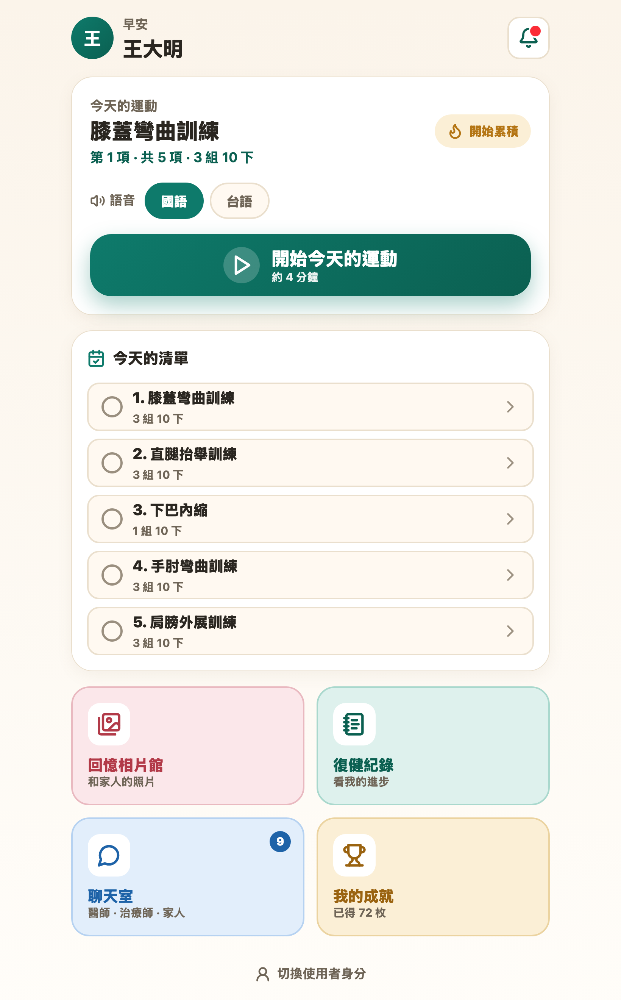
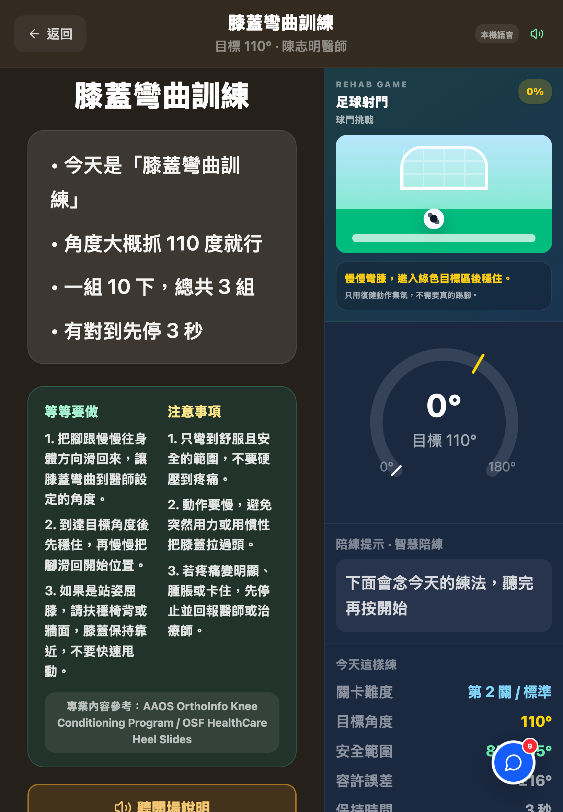
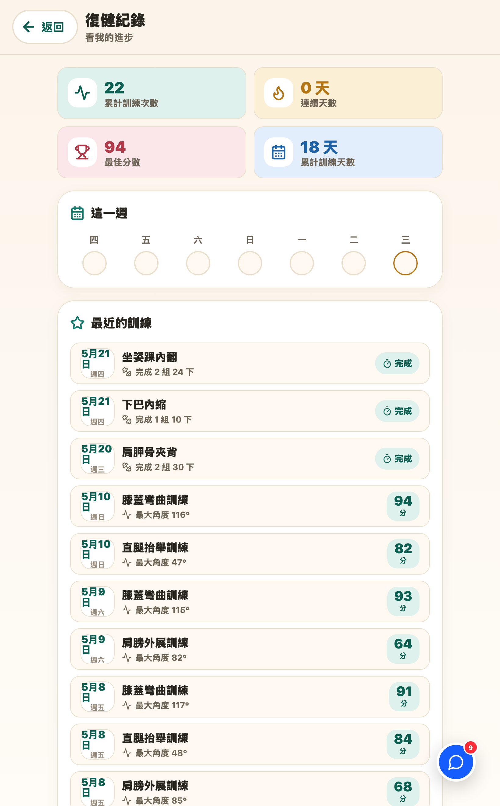
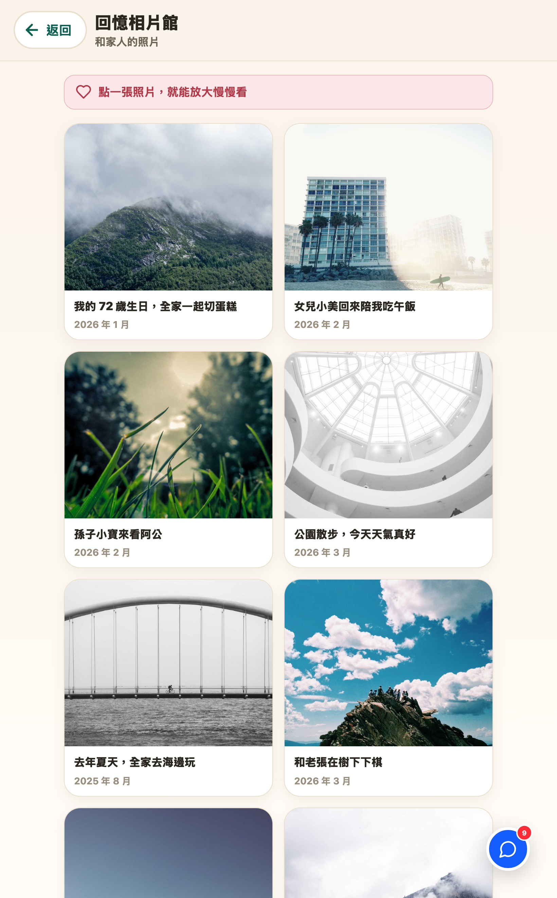
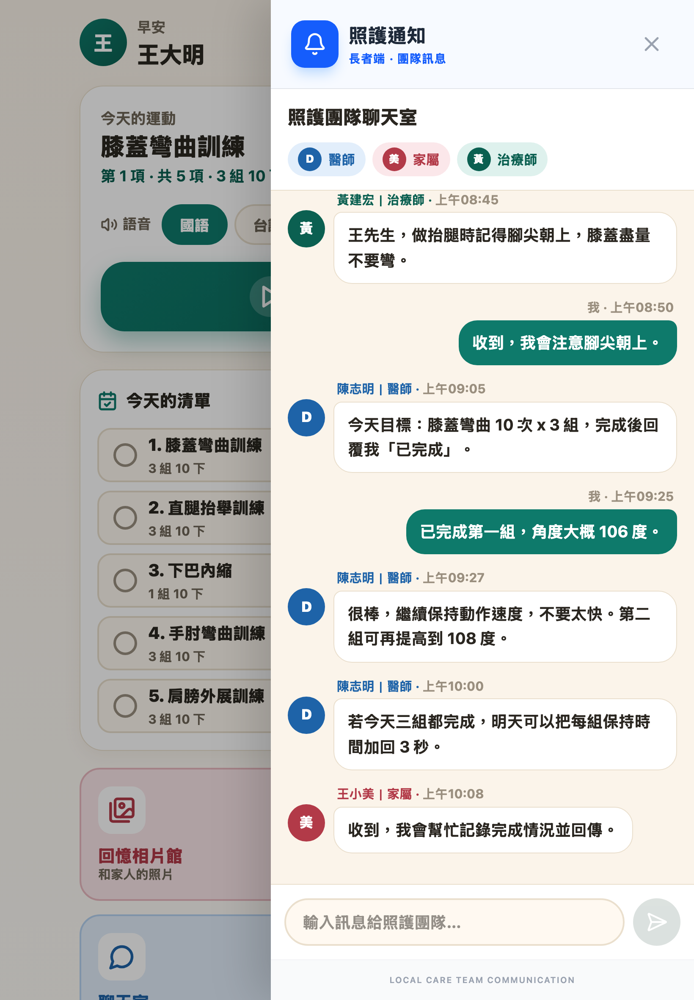

# RehabBridge 長者端 — 重新設計展示

> 設計目標：**畫面資訊簡單、長者易於學習與使用**。
> 設計語言：**溫暖親和**（暖奶油底＋青綠主色）、**大字高對比**（主文 18–20px、按鈕 22–25px）、**大點擊區**（所有可點元件 ≥ 56px）、**大圓角柔和陰影**。
> 全部頁面共用同一套設計系統（`src/app/components/elderly/`），未更動全域 `theme.css`，家屬／醫師端不受影響。

---

## 設計系統重點

| 項目 | 規格 |
|---|---|
| 頁面底色 | `#FBF4EA` 暖奶油 |
| 主色（健康／鼓勵） | `#0E7A6B` 青綠 |
| 鼓勵／成就 | `#B47514` 暖琥珀 |
| 主文字 | `#2A2620` 近黑暖調（高對比） |
| 最小點擊區 | 56px |
| 主按鈕高度 | 76px |
| 共用元件 | 頁框、頂部列、超大主按鈕、功能格、區塊卡、狀態小標 |

---

## 1 · 長者主頁「今日任務 Hub」

把原本抽象的「復健闖關」彩虹關卡地圖，換成**一眼就懂的今日任務中心**：大字問候 → 今日要做什麼 → 一鍵開始 → 四個大入口（回憶相片館／復健紀錄／聊天室／我的成就）。

- 今日任務大卡：下一個動作名稱、第幾項/共幾項、預估時間、國語／台語切換
- 超大主按鈕「開始今天的運動」直接進入正確訓練頁
- 今日清單：每項 ≥ 64px 大列，可單獨點開始
- 移除重複的全域聊天浮球；連續天數為 0 時顯示「開始累積」；成就顯示「已得 X 枚」

| Before（舊：闖關地圖） | After（新：今日任務 Hub） |
|---|---|
|  |  |

---

## 2 · 角度訓練頁（AI 姿態偵測）

相機／AR 偵測頁面，深色有助於凸顯鏡頭與骨架，因此採「**冷海軍藍 → 暖炭色**」+ 暖色點綴，而非翻成全亮色；**完整保留**姿態偵測、語音教練與遊戲核心。

- 背景由冷藍 `#111D2D` 改為暖炭 `#26201A`
- 開場「開始」鈕由冷藍漸層改為青綠（與主頁一致）
- 「聽開場說明」鈕改暖琥珀
- 開場說明重點化、角度錶與即時數值維持大字

| Before（舊：冷藍） | After（新：暖炭） |
|---|---|
|  |  |

---

## 3 · 引導訓練頁（計時／手動計次）

修正了**標題破版 bug**——原本整頁用「固定一個視窗高度 + overflow-hidden」的橫向儀表板佈局，在長者用的直式平板／手機上內容被裁切（標題「下巴水平往後收」被切掉）。改為**自然縱向捲動**後完整顯示。

- 修破版：固定高度 + 隱藏溢出 → 可捲動的縱向流式佈局
- 根底色暖化、英雄卡改暖炭、進度條藍 → 青綠
- 3 步驟圖示、保持秒數、總目標清楚呈現

| Before（舊：標題破版） | After（新：修正＋暖化） |
|---|---|
|  |  |

---

## 4 · 復健紀錄（新建頁）

把原本埋在主頁裡的紀錄，抽成**獨立的進步呈現頁**，接真實的 `sessionStore` / `guidedSessionStore` 資料。

- 4 大數字總覽：累計訓練次數、連續天數、最佳分數、累計訓練天數
- 本週 7 天訓練圈（今天以琥珀環標示）
- 最近訓練清單：日期 ＋ 動作 ＋ 最大角度／組數 ＋ 分數

---

## 5 · 親子回憶相片館（新建頁）

長者端的情感亮點：和家人的照片，**大圖、大字、好瀏覽**。

- 2 欄大相片卡，暖色說明 ＋ 日期
- 點圖放大檢視，可上一張／下一張
- 相片載入失敗時以暖色底圖優雅降級

---

## 6 · 聊天室（長者視角重設計）

照護團隊三方互動：**主治醫師／治療師／家人**，視覺改為長者友善。

- 大字大泡泡、對方訊息有頭像
- 角色配色一眼分辨：醫師藍、治療師綠、家人玫瑰
- 大輸入列、清楚的「姓名｜角色 · 時間」
- 家屬／醫師端聊天維持原樣（共用元件不影響其他端）

---

## 技術備註

- 截圖以本機 headless Chromium 產生（`scripts/screenshot.mjs`），檔案位於 `docs/ui-shots/`
- 視覺語言集中於 `src/app/components/elderly/`（`tokens.ts` 色彩尺寸、`ElderlyKit.tsx` 共用元件）
- 新增路由：`/patient/memories`、`/patient/records`
- 原規劃以 Figma MCP 擷取，但帳號為 Starter／View 席位、MCP 月額度已用罄，故改以本機截圖展示
